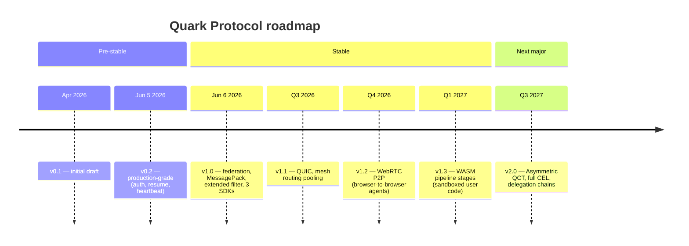

<div align="center">

```
  ██████  ██    ██  █████  ██████  ██   ██
 ██    ██ ██    ██ ██   ██ ██   ██ ██  ██
 ██    ██ ██    ██ ███████ ██████  █████
 ██ ▄▄ ██ ██    ██ ██   ██ ██   ██ ██  ██
  ██████   ██████  ██   ██ ██   ██ ██   ██
     ▀▀
```

# **Quark Protocol**

### Streaming-first AI tool protocol. Successor to MCP. **v1.0 stable.**

[](./LICENSE)
[](./docs/spec.md)
[]()
[](https://www.npmjs.com/package/@fasad_salatov/quark-client)

[**🌐 Live demo**](https://unyly.org/quark) · [**📖 Online spec**](https://fasadsalatov.github.io/quark/) · [**💬 Discussion**](https://t.me/Fasad_Salatov) · [**🐙 Repo**](https://github.com/FasadSalatov/quark)

</div>

---

## ▸ Why Quark exists

**MCP** (Anthropic's Model Context Protocol) became the default for AI tooling in 2024. It's JSON-RPC over stdio/SSE — designed for desktop apps. In production it **cracks**:

<table>
<tr>
<td width="50%" valign="top">

### ✗ MCP problems

```
× No native streaming
× Stateless per call (burns tokens)
× No composition (N round-trips)
× No subscriptions (poll loops)
× No backpressure (DoS-able)
× No multi-agent
× No capability model
× No reconnect (state lost)
× No cost transparency
× No audit trail
× No federation
```

</td>
<td width="50%" valign="top">

### ✓ Quark fixes

```
✓ Streaming-native (every tool)
✓ Stateful sessions (saves tokens)
✓ Pipeline composition (10× faster)
✓ Subscriptions (push events)
✓ Backpressure (flow control)
✓ Multi-agent native
✓ QCT capability tokens
✓ Session resume after drop
✓ Cost tracking in every call
✓ W3C distributed tracing
✓ Federation (server mesh)
```

</td>
</tr>
</table>

These weren't bugs — they're architectural consequences of JSON-RPC. Fixing them required rewriting the protocol from scratch.

---

## ▸ The killer feature: server-side composition

```json
{
  "kind": "INV",
  "pipeline": [
    { "tool": "github.list_repos", "input": { "owner": "anthropic" } },
    { "filter": "stars > 100 && owner == 'anthropic'" },
    { "map": ["name"] },
    { "tool": "slack.notify", "input_bind": { "items": "$prev", "channel": "#dev" } }
  ]
}
```

**One round-trip. Server executes the whole chain.** ~800ms → ~80ms in real workloads.

<details>
<summary><b>▸ Why this is huge</b></summary>

With MCP, that same workflow needs:
1. Call `github.list_repos` → wait → receive 100 repos
2. Filter client-side, send back only top-N
3. Call `slack.notify` for each
4. Repeat

That's 4 HTTP round-trips, with full payload each time. AI agents pay token cost + latency cost on each.

Quark's pipeline collapses all of it into one frame. Server handles filter/map/forward locally. Client gets only the final result.

</details>

---

## ▸ Quick start

<table>
<tr>
<td valign="top">

### TypeScript
```bash
pnpm add @fasad_salatov/quark-client
```

```ts
import { Quark, QCT } from
  '@fasad_salatov/quark-client'

const token = await QCT.create({
  secret: process.env.QUARK_SECRET!,
  payload: {
    iss: 'https://my-app.com',
    sub: 'user@example.com',
    exp: Math.floor(Date.now() / 1000) + 3600,
    scope: ['echo:invoke'],
  },
})

const ch = await Quark.connect(
  'wss://unyly.org/quark/ws',
  {
    agent: { id: 'my-bot', kind: 'llm' },
    auth: { type: 'bearer', token },
  },
)

const result = await ch.invoke(
  'echo.upper', { text: 'hello' }
)
```

</td>
<td valign="top">

### Python
```bash
pip install git+https://github.com/\
FasadSalatov/quark#subdirectory=\
clients/python
```

```python
from quark_client import Quark, QCT
import time, asyncio

async def main():
    token = QCT.create("secret", {
        "iss": "https://my-app.com",
        "sub": "user@example.com",
        "exp": int(time.time()) + 3600,
        "scope": ["echo:invoke"],
    })

    async with await Quark.connect(
        "wss://unyly.org/quark/ws",
        agent={"id": "my-bot",
               "kind": "llm"},
        auth={"type": "bearer",
              "token": token},
    ) as ch:
        r = await ch.invoke(
            "echo.upper",
            {"text": "hello"}
        )

asyncio.run(main())
```

</td>
<td valign="top">

### Go (server)
```bash
go get github.com/FasadSalatov/\
quark/clients/go@v1.0.0
```

```go
import quark "github.com/\
FasadSalatov/quark/clients/go"

srv := quark.NewServer(
    &quark.ServerOptions{
        Secret: []byte(
            os.Getenv("QUARK_SECRET"),
        ),
        SessionTTL: time.Hour,
    },
)

srv.RegisterTool(quark.Tool{
    Name: "echo.upper",
    Capability: "echo:invoke",
    Handler: func(ctx context.Context,
        in map[string]any,
    ) (any, *quark.Cost, error) {
        text := in["text"].(string)
        return strings.ToUpper(text),
            &quark.Cost{ComputeMs: 1},
            nil
    },
})

http.Handle("/quark/ws", srv)
http.ListenAndServe(":3011", nil)
```

</td>
</tr>
</table>

---

## ▸ Live demo

> **[unyly.org/quark](https://unyly.org/quark)** — open in browser, press «connect», watch real v1.0 WebSocket frames in action.

What you'll see:
- 🔄 Real-time bidirectional WebSocket frames
- 💰 Cost accumulator (compute_ms, api_calls, USD)
- ❤️ Heartbeat (HBT/HBA every 30s)
- 🧬 Session ID + protocol version badges
- 🚨 Input validation errors (try sending malformed input)
- 🔗 Pipeline composition in action
- 📡 Live subscription to demo.heartbeat topic

---

## ▸ How it works

```mermaid
sequenceDiagram
    autonumber
    participant C as AI Agent
    participant S as Quark Server
    participant T1 as github.list_repos
    participant T2 as slack.notify

    Note over C,S: Single WebSocket channel
    C->>S: HEY (auth + capabilities)
    S->>C: HEY (session_id, granted)

    rect rgb(60, 30, 80)
    Note over C,S: Pipeline composition (1 frame)
    C->>S: INV pipeline [list_repos → filter → notify]
    S->>T1: invoke
    T1-->>S: results
    Note over S: filter stars > 100
    Note over S: map [name]
    S->>T2: invoke (with filtered)
    T2-->>S: ok
    S->>C: RES + cost
    end

    Note over C,S: Heartbeat keeps connection alive
    loop every 30s
        C->>S: HBT
        S->>C: HBA
    end

    Note over C,S: On disconnect — resume keeps state
    C-x S: connection drops
    C->>S: RSM (session_id, last_seq)
    S->>C: replay buffered frames
```



---

## ▸ What v1.0 brings

<table>
<tr><td width="33%" align="center">

### 🔐
**QCT auth**
HMAC-SHA256 signed capability tokens. Scope, expiry, max_cost_usd. Servers verify.

</td><td width="33%" align="center">

### 🔄
**Session resume**
Mobile-friendly. iPhone drops 4G → reconnect → replay missed frames.

</td><td width="33%" align="center">

### ❤️
**Heartbeat**
HBT/HBA every 30s. Detect dead connections. State held for TTL.

</td></tr>
<tr><td align="center">

### 📊
**Cost tracking**
Every RES/END returns `cost: { compute_ms, api_calls, usd, tokens }`.

</td><td align="center">

### 🔍
**Tracing**
W3C trace_id/span_id in every frame. OpenTelemetry compatible.

</td><td align="center">

### 🌐
**Federation**
Server-to-server routing via mesh discovery. Specialized servers.

</td></tr>
<tr><td align="center">

### 📦
**MessagePack**
Opt-in binary frames via subprotocol negotiation.

</td><td align="center">

### 🎯
**Extended filter**
`matches`, `in`, `notIn`, arithmetic, nested fields, regex.

</td><td align="center">

### 🔒
**Stable v1.0**
No breaking changes through v1.x. v2.0 = 12-month deprecation.

</td></tr>
</table>

---

## ▸ Reference implementations

All three SDKs produce **identical output** for every spec case (verified by cross-language conformance suite).

| Lang | Package | Status | Path |
|---|---|---|---|
| **Go** | `github.com/FasadSalatov/quark/clients/go@v1.0.0` | []() | [`clients/go/`](./clients/go) |
| **TypeScript** | `@fasad_salatov/quark-client@1.0.0` | [](https://www.npmjs.com/package/@fasad_salatov/quark-client) | [`clients/typescript/`](./clients/typescript) |
| **Python** | `quark-client` (GitHub install) | []() | [`clients/python/`](./clients/python) |
| **Conformance** | Cross-language test suite | []() | [`tests/conformance/`](./tests/conformance) |

---

## ▸ MCP compatibility

```
┌─────────────┐  Quark   ┌──────────────┐   MCP   ┌──────────────────┐
│  AI agent   │────────▶│ Quark adapter │────────▶│ legacy MCP server│
└─────────────┘          └──────────────┘          └──────────────────┘
```

Zero migration cost. Clients use Quark. Existing MCPs keep working through the adapter. Authors migrate to native Quark when they want streaming/composition/auth.

---

## ▸ Roadmap



---

## ▸ Test coverage

```
clients/go/              35 unit tests   ✓ 0.5s
  conformance/           16 conformance  ✓ 0.7s
clients/typescript/      21 unit tests   ✓ 0.2s
clients/python/          22 unit tests   ✓ 0.6s
tests/conformance/       17 × 3 = 51 assertions ✓

Total: 78 unit + 51 conformance = 129 assertions, all green
```

Run all locally:
```bash
./tests/conformance/run.sh
```

CI on every push: [.github/workflows/conformance.yml](./.github/workflows/conformance.yml)

---

## ▸ Spec at a glance

<table>
<tr><td>

**Sections**
1. Stability guarantee
2. Motivation
3. Design goals
4. Transport
5. Frame format
6. Channels
7. Auth & QCT
8. Message kinds
9. Handshake
10. Heartbeat
11. Session resume
12. Tool registration
13. Invoking tools
14. Filter language
15. Subscriptions
16. Backpressure
17. Errors
18. Federation
19. Tracing
20. MCP compatibility
21. Reference impls
22. Roadmap

</td><td valign="top">

**Sizes**
- **Spec:** ~600 lines markdown (MIT)
- **Frame format:** 4-byte header + JSON
- **Message kinds:** 14 opcodes (3 chars each)
- **Error codes:** 15 stable
- **QCT format:** stable v1
- **Filter grammar:** stable v1

**Stability guarantee**

v1.0 is **stable**. Breaking changes deferred to v2.0 with 12-month deprecation window.

Non-breaking additions ship in v1.x.

</td></tr>
</table>

📖 Full spec: [`docs/spec.md`](./docs/spec.md) · [Online HTML version](https://fasadsalatov.github.io/quark/)

---

## ▸ Try it now

```bash
# 1. Install TypeScript SDK
pnpm add @fasad_salatov/quark-client

# 2. Open the live demo in your browser
open https://unyly.org/quark

# 3. Or run reference server locally
git clone https://github.com/FasadSalatov/quark.git
cd quark/clients/go
go run example/main.go  # if you add the example
# Or in main.go:
# srv := quark.NewServer(&quark.ServerOptions{AllowAnonymous: true})
# quark.RegisterDemoTools(srv)
# http.Handle("/quark/ws", srv)
# http.ListenAndServe(":3011", nil)
```

---

## ▸ Contributing

This is an **open spec**. Contributions welcome:

- 🐛 **Issues** for spec ambiguities or impl bugs: [github.com/FasadSalatov/quark/issues](https://github.com/FasadSalatov/quark/issues)
- 🔧 **PRs** for additional client SDKs (Rust, Swift, Java, .NET) — keep them conformant to `tests/conformance/cases.json`
- 💬 **Discussion** about the spec direction: [unyly.org/quark](https://unyly.org/quark) or Telegram [@Fasad_Salatov](https://t.me/Fasad_Salatov)
- 📜 **Launch material** in [`docs/launch/`](./docs/launch) — Show HN draft, Twitter thread, Reddit post

---

## ▸ Star history

[](https://star-history.com/#FasadSalatov/quark&Date)

---

## ▸ License

**MIT** — see [LICENSE](./LICENSE).

You can use Quark in commercial products, embed it in proprietary systems, fork it, modify it. Attribution appreciated but not required.

---

<div align="center">

### Built by [Unyly](https://unyly.org) · [Fasad Salatov](https://github.com/FasadSalatov)

**Unyly is an MCP marketplace** with 15,000+ servers indexed.
We hit MCP's production limits while scaling. Quark is the protocol we wished we had.

[unyly.org](https://unyly.org) · [unyly.org/quark](https://unyly.org/quark) · [@Fasad_Salatov](https://t.me/Fasad_Salatov)

```
                                      ▄▄
                                  ▀▀▀▀ ▀▀▀
                              ▀▀▀▀
                          ▀▀▀▀
                      ▀▀▀▀
                  ▀▀▀▀
              ▀▀▀▀
          ▀▀▀▀
      ▀▀▀▀
  ▀▀▀▀

  ❯ shipped 2026-06-06
```

</div>
